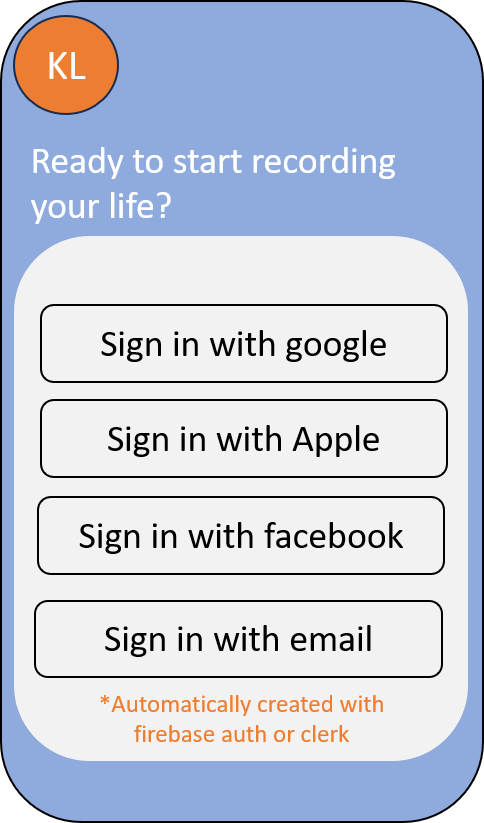
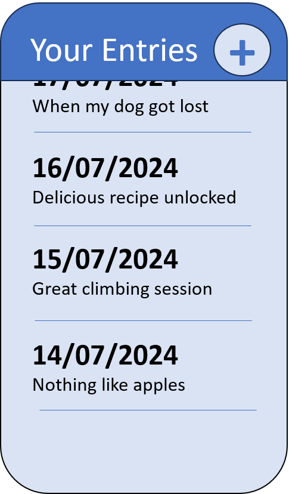
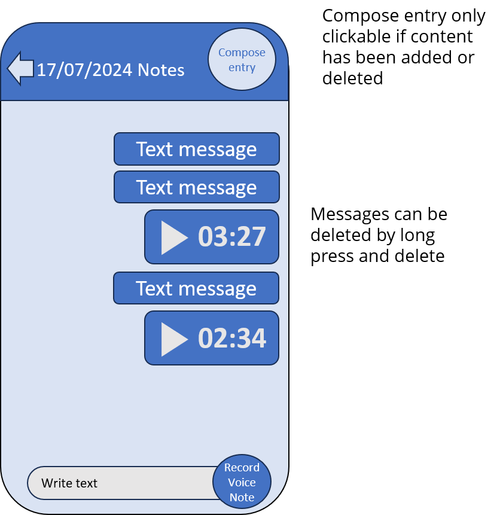

# UX guidelines
This document outlines the main ux flows. 

All of the ui components must be done following state of the art design best practices. The images provided throughout the document are only wireframes to be used for orientation purposes. The designer's criteria regarding style is looked well upon. 

1. When a user first opens the app he is directed to the login page 
2. After login he is directed to the main page 
3. When a user clicks on the add entry button with the plus at the top he is directed to the content page 
4. The content page has a chat interface very similar to whatsapp. One can send text messages or voice notes. 
5. A text input at the button allows you to type in text and send it.
6. A record button at the bottom right allows you to record voice notes. While pressing the button the voice note is being recorded and when it is released the voice note is sent. 
7. The text messages and voice notes appear in a scrollable chat like interface above.
8. When entering the content page the existing text messages and voice notes must be fetched from the server and shown in chronological order. 
9. Voice notes can be played when pressing the play button in the message.
10. When long pressing a text message or voice note a delete icon button will appear. If pressed, the message will be deleted. 
11. When a text message or voice not are sent they must be uploaded to the server.
12. If the compose button at the top right of the content page is pressed, a call to /api/compose-text/ is made, which returns a fully composed text message. While waiting for the response, a loading modal should appear. When successfully getting the response, a success animation should appear. 
13. If the back button is pressed, the user will be directed to the entry page with the composed text showing.
14. If the user presses the edit button, the text must be editable. The user will be able to save the edited text with a save button.
15. When saving the edited text it will be uploaded to the server.
16. If the back button is pressed in the entry page the user will be directed to the main page. 
17. The main page should show all entries in chronological order.
18. The app will fetch all information (entries, content) at the start of the app to avoid making frequent calls to the server.

